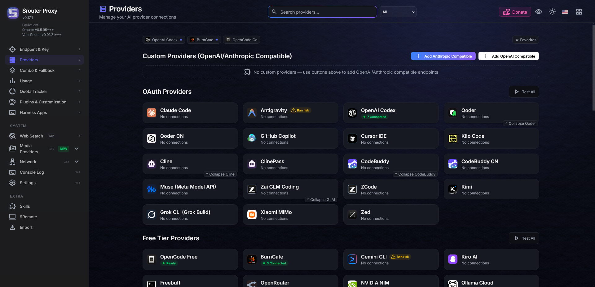
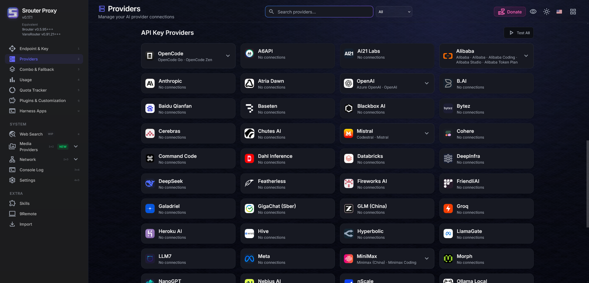
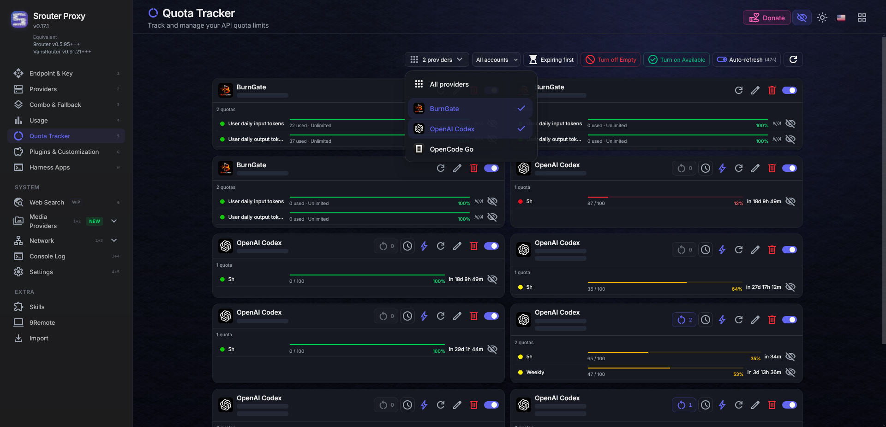
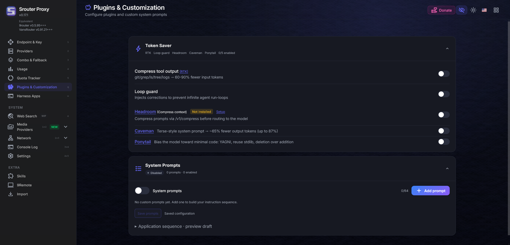
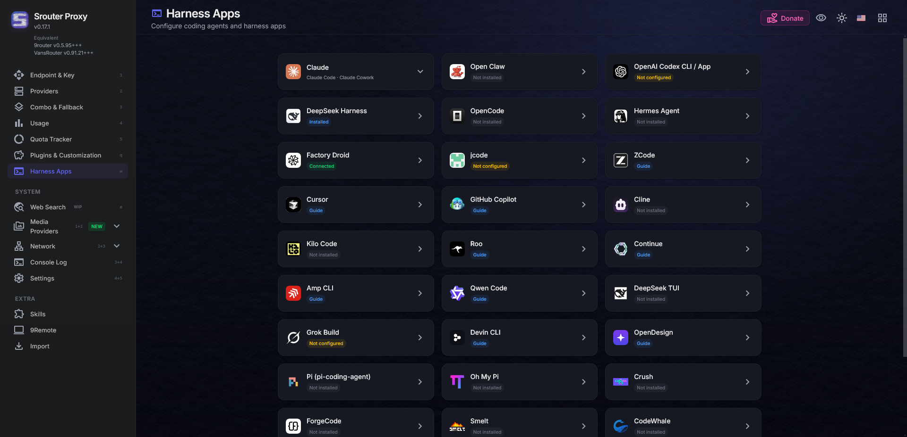
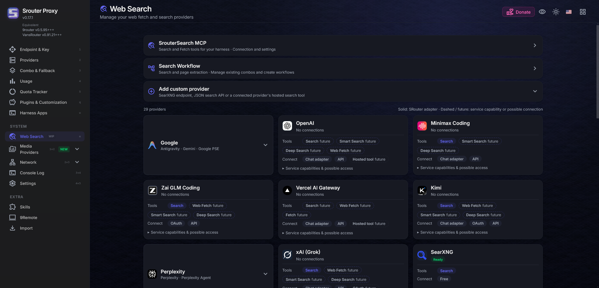
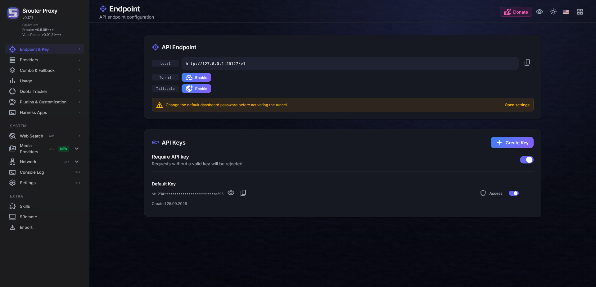
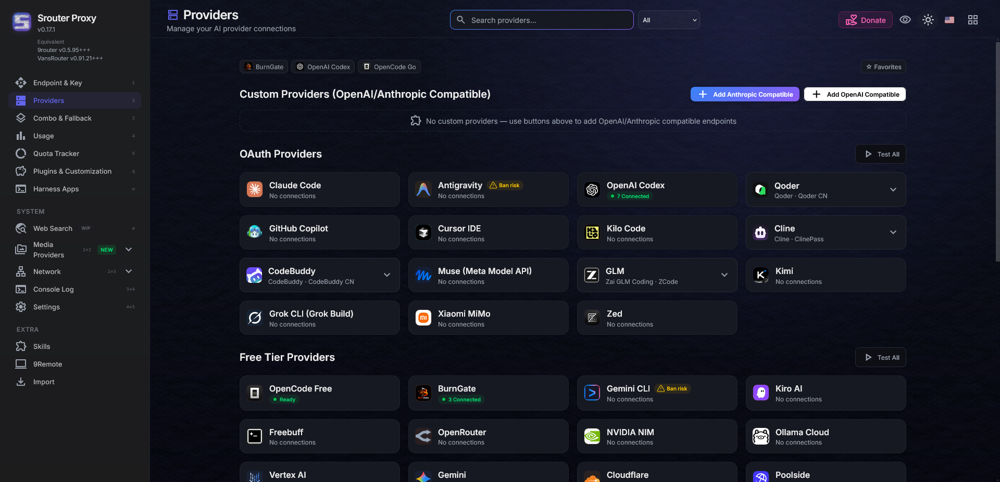

# Srouter

Все тоже самое что в github.com/decolua/9router но лучше.

Dashboard: http://localhost:20127

## Release

[Releases](https://github.com/seezyes/Srouter/releases/tag/v0.17.1), extract it and run `Start Srouter.cmd`.

## Licenses

Лицензия Apache-2.0 — см. [LICENSE](LICENSE) для деталей.
